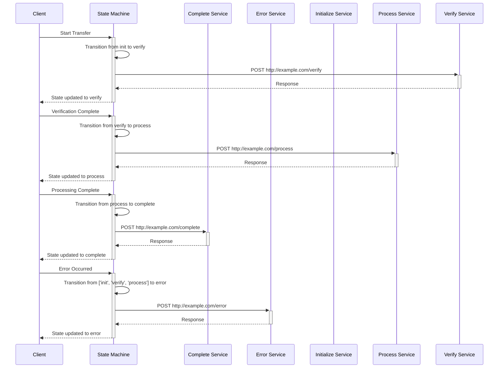

# Sequence Diagram

```mermaid
sequenceDiagram
    participant C as Client
    participant SM as State Machine
    participant Complete as Complete Service
    participant Error as Error Service
    participant Initialize as Initialize Service
    participant Process as Process Service
    participant Verify as Verify Service
    C->>+SM: Start Transfer
    SM->>SM: Transition from init to verify
    SM->>+Verify: POST http://example.com/verify
    Verify-->>-SM: Response
    SM-->>-C: State updated to verify

    C->>+SM: Verification Complete
    SM->>SM: Transition from verify to process
    SM->>+Process: POST http://example.com/process
    Process-->>-SM: Response
    SM-->>-C: State updated to process

    C->>+SM: Processing Complete
    SM->>SM: Transition from process to complete
    SM->>+Complete: POST http://example.com/complete
    Complete-->>-SM: Response
    SM-->>-C: State updated to complete

    C->>+SM: Error Occurred
    SM->>SM: Transition from ['init', 'verify', 'process'] to error
    SM->>+Error: POST http://example.com/error
    Error-->>-SM: Response
    SM-->>-C: State updated to error

```
