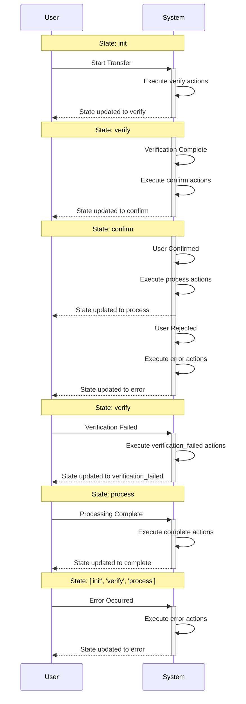

# Sequence Diagram

```mermaid
sequenceDiagram
    participant User
    participant System
    Note over User,System: State: init
    User->>+System: Start Transfer
    System->>System: Execute verify actions
    System-->>-User: State updated to verify
    Note over User,System: State: verify
    activate System
    System->>System: Verification Complete
    System->>System: Execute confirm actions
    System-->>User: State updated to confirm
    deactivate System
    Note over User,System: State: confirm
    activate System
    System->>System: User Confirmed
    System->>System: Execute process actions
    System-->>User: State updated to process
    deactivate System
    activate System
    System->>System: User Rejected
    System->>System: Execute error actions
    System-->>User: State updated to error
    deactivate System
    Note over User,System: State: verify
    User->>+System: Verification Failed
    System->>System: Execute verification_failed actions
    System-->>-User: State updated to verification_failed
    Note over User,System: State: process
    User->>+System: Processing Complete
    System->>System: Execute complete actions
    System-->>-User: State updated to complete
    Note over User,System: State: ['init', 'verify', 'process']
    User->>+System: Error Occurred
    System->>System: Execute error actions
    System-->>-User: State updated to error
```
