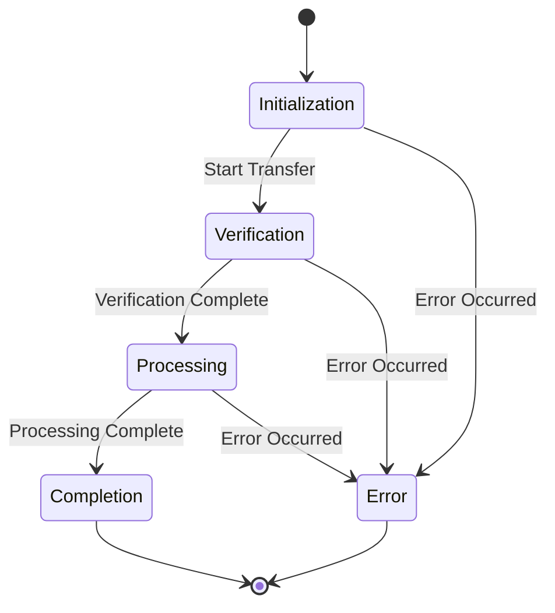

# State Diagram

```mermaid
stateDiagram-v2
    [*] --> init
    init: Initialization
    verify: Verification
    process: Processing
    complete --> [*]
    complete: Completion
    error --> [*]
    error: Error
    init --> verify: Start Transfer
    verify --> process: Verification Complete
    process --> complete: Processing Complete
    init --> error: Error Occurred
    verify --> error: Error Occurred
    process --> error: Error Occurred
```
